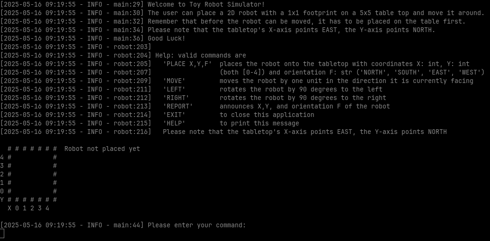
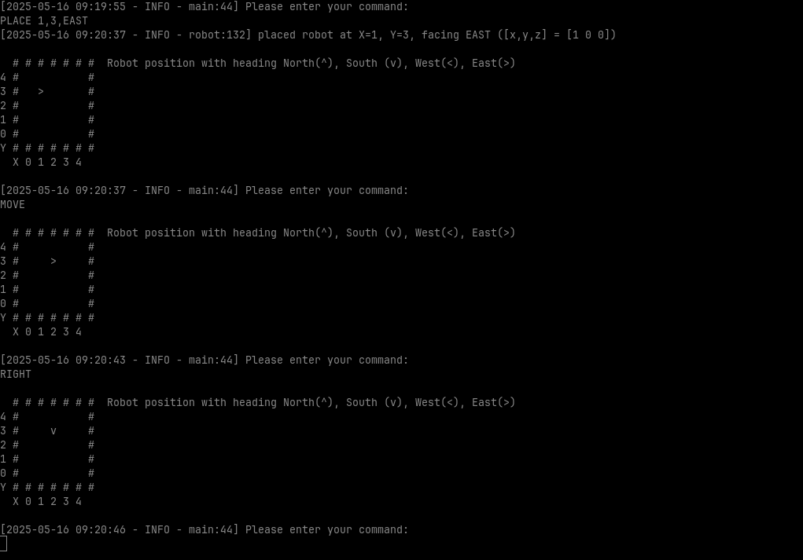

# toy_robot_simulator
The player can place a 2D robot with a 1x1 footprint on a 5x5 table top and move it around.


  
Sönke Niemann, 2025-05-16

## Install
Make sure you have **Python 3.10 or newer**. To install, clone this repository and enter its directory, then install the requirements through pip.
```bash
git clone https://github.com/niemsoen/toy_robot_simulator.git
cd toy_robot_simulator
pip install -r requirements.txt
```

## Run
To run, execute the `main.py` with your Python interpreter. A **140x24 terminal window size** is recommended. Remember that before the robot can be moved, it has to be placed on the table first. Please note that the tabletop's X-axis points EAST, the Y-axis points NORTH. 
Good Luck!
```bash
python3 main.py
```

**Gameplay Screenshots**



## Developers
- To **test the functionality** of the `robot.py` module, simply run the test cases with:

    ```bash
    pytest
    ```

- Keep the **code consistent** with `pylint`.

    ```bash
    pylint *.py
    ```

- Find **application logs** in `toy_robot_simulator.log` after execution.
